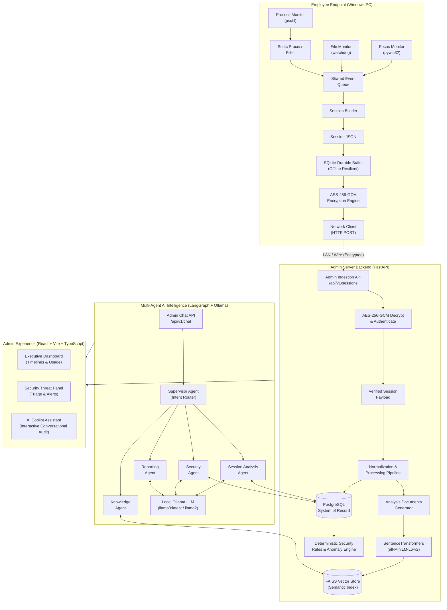

# WorkGuard

<div align="center">

**AI-Powered Endpoint Telemetry, Security Auditing & Multi-Agent RAG Intelligence for Modern Organizations**

[](#endpoint-telemetry-engine)
[](#cryptographic-pipeline--zero-leak-security)
[](#multi-agent-ai-framework)
[](#secure-ingestion--database-layer)
[](#admin-frontend-experience)
[](#zero-leak-data-security)

*Autonomous Telemetry. Zero-Cloud-Leak Intelligence. Total Endpoint Peace of Mind.*

</div>

---

## Table of Contents

1. [Executive Overview](#executive-overview)
2. [The Enterprise Challenge](#the-enterprise-challenge)
3. [End-to-End System Architecture](#end-to-end-system-architecture)
4. [Core Components Deep Dive](#core-components-deep-dive)
   - [1. Endpoint Telemetry Engine](#1-endpoint-telemetry-engine)
   - [2. Cryptographic Pipeline & Zero-Leak Security](#2-cryptographic-pipeline--zero-leak-security)
   - [3. Secure Ingestion & PostgreSQL System of Record](#3-secure-ingestion--postgresql-system-of-record)
   - [4. Multi-Agent AI Framework (LangGraph & Ollama)](#4-multi-agent-ai-framework-langgraph--ollama)
   - [5. Admin Frontend Experience](#5-admin-frontend-experience)
5. [Incident Triage Efficiency](#incident-triage-efficiency)
6. [Repository Structure](#repository-structure)
7. [Prerequisites](#prerequisites)
8. [Setup & Installation Guide](#setup--installation-guide)
   - [Step 1: Clone Repository & Shared Encryption Key](#step-1-clone-repository--shared-encryption-key)
   - [Step 2: PostgreSQL Database Setup & Configuration](#step-2-postgresql-database-setup--configuration)
   - [Step 3: Ollama Local LLM Setup & Verification](#step-3-ollama-local-llm-setup--verification)
   - [Step 4: Admin Server Setup (FastAPI Backend)](#step-4-admin-server-setup-fastapi-backend)
   - [Step 5: Admin Web Dashboard Setup (React + Vite)](#step-5-admin-web-dashboard-setup-react--vite)
   - [Step 6: Employee Endpoint Client Setup (Windows Agent)](#step-6-employee-endpoint-client-setup-windows-agent)
9. [Configuration Reference](#configuration-reference)
10. [REST API Documentation](#rest-api-documentation)
11. [Applied AI Lessons & Technical Highlights](#applied-ai-lessons--technical-highlights)
12. [Milestones & Future Roadmap](#milestones--future-roadmap)
13. [Troubleshooting & FAQ](#troubleshooting--faq)

---

## Executive Overview

**WorkGuard** is an enterprise-grade endpoint security, activity auditing, and forensic intelligence platform. Designed specifically for distributed and hybrid engineering teams, WorkGuard unifies continuous, lightweight client telemetry with an air-gapped, multi-agent AI copilot.

Traditional enterprise security monitoring either compromises employee privacy by exfiltrating proprietary code and logs to third-party clouds, or inundates security operators with tens of thousands of fragmented, contextless raw events. WorkGuard solves both problems simultaneously:

* **100% Air-Gapped & Local Privacy:** Operates with zero cloud dependencies. Raw source code, confidential file system paths, and workstation activities are processed exclusively via on-premises/local **Ollama LLMs** and self-hosted **FAISS vector embeddings**.
* **End-to-End Cryptography:** Client sessions are buffered into an offline-resilient encrypted SQLite database and transmitted over the wire authenticated with **AES-256-GCM**.
* **Autonomous Multi-Agent Triage:** A cyclic **LangGraph** multi-agent network (Supervisor, Session Analysis, Security, Knowledge, and Reporting agents) investigates anomalies, evaluates productivity, and generates compliance-grade forensic audit reports in seconds.

---

## The Enterprise Challenge

| The Visibility Gap | The WorkGuard Solution |
| :--- | :--- |
| **Distributed Modern Teams:** Remote and hybrid workstations operate across unmonitored local environments where unauthorized software, shadow IT, and suspicious background processes thrive undetected. | **Continuous Lightweight Telemetry:** Background agent capturing process snapshots, foreground active window focus, file system mutations, and developer Git commits. |
| **Fragmented Raw Logs:** Security administrators are inundated with massive volumes of raw logs, lacking unified timelines or context to distinguish genuine productivity from data exfiltration risks. | **Multi-Agent RAG Intelligence:** Centralized multi-agent AI system delivering automated security scoring, conversational natural language audit queries, and real-time executive dashboards. |
| **Cloud Data Leakage:** Sending terminal logs, active code paths, and employee behavioral data to commercial AI APIs exposes trade secrets and violates strict compliance mandates (GDPR, HIPAA, SOC 2). | **Zero Cloud Dependence:** Fully local inference using Ollama and self-hosted FAISS vectors guarantees confidential telemetry never leaves the enterprise boundary. |

---

## End-to-End System Architecture



---

## Core Components Deep Dive

### 1. Endpoint Telemetry Engine

The WorkGuard employee client runs silently as a background service on Windows workstations, gathering rich telemetry without impacting system performance or user productivity:

```
Telemetry Event Composition:
┌─────────────────────────────────────────────────────────────┐
│ ■ Active Window Focus (45%)  - pywin32 foreground handles   │
│ ■ Process Activity (30%)     - psutil software & CPU state  │
│ ■ Watchdog File Events (15%) - local disk writes/modifies   │
│ ■ Git & Code Metadata (10%)  - branch switches & commits    │
└─────────────────────────────────────────────────────────────┘
```

* **Focus Tracking (45%):** Samples active foreground window handles in real-time using `pywin32`, tracking exact user engagement vs. idle grace intervals to compute net focused work.
* **Process Activity Snapshots (30%):** Leverages `psutil` combined with an intelligent static process filter to capture active applications while ignoring benign OS threads.
* **File System Watchdog (15%):** Uses `watchdog` to monitor creation, modification, deletion, and directory movements across monitored project repositories, identifying potential source code tampering.
* **Developer Telemetry (10%):** Links local Git commits, diff statistics, and branch transitions directly to monitored working intervals.
* **Ollama Whitelist Monitor:** Detects localized AI inference tools on the client to ensure developers run authorized models within organizational guidelines.
* **Offline Durable SQLite Buffer:** If an endpoint disconnects from the corporate network or goes offline, all events and sessions are buffered locally in an encrypted SQLite database and flushed automatically when connectivity is restored.

---

### 2. Cryptographic Pipeline & Zero-Leak Security

WorkGuard adheres strictly to a zero-trust, zero-leak cryptographic standard:

1. **Symmetric Key Generation:** A 256-bit cryptographically secure pseudorandom key is generated and shared between the authorized admin server and client instances.
2. **Authenticated Encryption (AES-256-GCM):** Each session payload is serialized and encrypted using AES-256 in Galois/Counter Mode. Every transmission includes a unique 12-byte initialization vector (nonce) and an authentication tag:
   ```json
   {
     "session_id": "sess_20260909_001",
     "employee_id": "SYS-B56B4DEB06F6",
     "encryption": {
       "algorithm": "AES-256-GCM",
       "nonce": "dGVzdG5vbmNlMTIzNA==",
       "ciphertext": "ZXhhbXBsZWNpcGhlcnRleHQ..."
     }
   }
   ```
3. **Decryption & Integrity Verification:** The Admin Server validates the authentication tag. If any payload byte has been tampered with in transit or the key does not match, the packet is rejected immediately.
4. **100% Local Confidentiality:** No telemetry, source code, commit messages, or file paths ever touch an external API.

---

### 3. Secure Ingestion & PostgreSQL System of Record

The **FastAPI** Admin Server serves as the authoritative gateway. Upon decryption and JSON schema validation, session records are normalized into a relational **PostgreSQL** schema optimized for fast forensic indexing and analytical aggregations:

* `employees`: Tracks employee machine identity, hostnames, usernames, first seen, and last seen timestamps.
* `sessions`: Stores session boundaries, total duration, idle seconds, application focus summaries (`JSONB`), and processing lifecycle status (`received`, `processed`, `failed`).
* `session_events`: High-frequency event log capturing window transitions, file mutations, and process events linked to session IDs.
* `reports`: Comprehensive AI-generated forensic reports, productivity assessments, and security digests.
* `analysis_documents` & `vector_metadata`: Structured text documents extracted from sessions for dense vector indexing.

---

### 4. Multi-Agent AI Framework (LangGraph & Ollama)

WorkGuard utilizes **LangGraph** to build a cyclic stateful agent network that eliminates hallucinations by anchoring all reasoning to deterministic PostgreSQL facts and FAISS vector embeddings:

```
                       Admin Inquiries
                             │
                             ▼
                 [ Supervisor / Router Agent ]
                             │
       ┌─────────────────────┼─────────────────────┐
       ▼                     ▼                     ▼
[ Session Agent ]    [ Security Agent ]    [ Reporting Agent ]
  • Timeline density   • Anomaly detection   • Executive briefs
  • App distributions  • Privilege checks    • Compliance digests
  • Context switching  • Policy violations  • Productivity scores
       │                     │                     │
       └─────────────────────┼─────────────────────┘
                             ▼
                  [ Knowledge Agent (FAISS) ]
                    • Semantic similarity
                    • Historical contexts
                             │
                             ▼
                 Unified Response with Citations
```

1. **Supervisor Router:** Evaluates incoming administrator inquiries using semantic classification to route to the optimal specialist agent.
2. **Session Analysis Agent:** Evaluates timeline densities, application distributions, deep focus intervals, and context switching across shifts.
3. **Security Agent:** Applies deterministic rules and LLM reasoning against suspicious processes (e.g., unauthorized remote access tools, crypto-miners, data staging scripts) and out-of-hours anomalies.
4. **Knowledge Agent:** Performs dense semantic vector searches over historical telemetry documents using **FAISS** and `sentence-transformers/all-MiniLM-L6-v2`.
5. **Reporting Agent:** Generates executive briefs, risk summaries, and compliance digests with exact session citations.

---

### 5. Admin Frontend Experience

Built with **React 19, TypeScript, Vite, and Lucide Icons**, the admin console provides three primary views:

* **Executive Dashboard:** Visualizes total workforce activity, active employees, timeline graphs, application distributions, and average session durations.
* **Security Threat Panel:** Instant triage interface for policy infractions, anomalous process executions, and severity-badged security alerts.
* **AI Copilot Assistant:** Conversational chat interface connecting administrators directly to the LangGraph multi-agent network, complete with suggested follow-up questions and cited telemetry records.

---

## Incident Triage Efficiency

WorkGuard dramatically reduces the time required to conduct security audits and forensic investigations:

| Methodology | Average Investigation Time |
| :--- | :--- |
| **Manual Log Forensic Audit** | ~120 minutes |
| **Scripted Terminal Queries** | ~50 minutes |
| **Standard Relational SQL SIEM** | ~25 minutes |
| **WorkGuard Multi-Agent RAG** | **2 minutes** ⚡ |

---

## Repository Structure

```text
WorkGuard/
├── README.md                      # Primary project documentation
├── admin-server/                  # Central Ingestion, Storage, AI & API Server
│   ├── api/                       # REST API routers (analytics, sessions, chat)
│   ├── agents/                    # LangGraph multi-agent system & state definitions
│   │   ├── supervisor_agent.py    # Intent classifier & orchestrator
│   │   ├── session_agent.py       # Session analysis specialist
│   │   ├── security_agent.py      # Security & anomaly detection specialist
│   │   ├── reporting_agent.py     # Executive & forensic report generator
│   │   ├── knowledge_agent.py     # FAISS semantic retrieval specialist
│   │   └── workflow.py            # LangGraph StateGraph compilation
│   ├── database/                  # PostgreSQL connection, schema & repositories
│   │   ├── connection.py          # psycopg database connection pooling
│   │   ├── repository.py          # CRUD data access layer
│   │   └── schema.py              # DDL schema definitions & migrations
│   ├── embeddings/                # Vector embedding generator (SentenceTransformers)
│   ├── frontend/                  # React + TypeScript + Vite administrative dashboard
│   ├── ingestion/                 # Session package ingestion & validation
│   ├── llm/                       # Ollama local LLM integration client
│   ├── processing/                # Document extraction & normalization pipeline
│   ├── retrieval/                 # Hybrid search (SQL + FAISS vector similarity)
│   ├── security/                  # AES-256-GCM decryption & verification helpers
│   ├── main.py                    # FastAPI server entry point
│   ├── requirements.txt           # Python dependencies for admin server
│   ├── .env.example               # Admin environment configuration template
│   └── package.json               # Frontend runner scripts
├── employee-client/               # Lightweight Windows Endpoint Telemetry Agent
│   ├── config/                    # Monitoring configuration (directories, thresholds)
│   ├── encryption/                # Local AES-256-GCM encryption
│   ├── monitoring/                # Sensor implementations (psutil, pywin32, watchdog)
│   ├── network/                   # Durable HTTP transmission client
│   ├── session_builder/           # Event aggregator & session packager
│   ├── storage/                   # Encrypted SQLite offline buffer
│   ├── main.py                    # Client agent entry point
│   ├── requirements.txt           # Python dependencies for employee client
│   └── .env                       # Client runtime environment configuration
└── docs/                          # Architecture blueprints and design specifications
```

---

## Prerequisites

Before setting up WorkGuard, ensure your environment meets the following requirements:

| Component | Minimum Requirement | Notes |
| :--- | :--- | :--- |
| **Operating System** | Windows 10/11 (for Client), Linux / macOS / Windows (for Server) | Client relies on `pywin32` for Windows window handles |
| **Python** | Python 3.10, 3.11, or 3.12 | Required for both admin-server and employee-client |
| **Node.js** | Node.js v18+ or v20+ & npm | Required to build and run the React Admin Dashboard |
| **PostgreSQL** | PostgreSQL 12+ (v14+ recommended) | Authoritative system of record for normalized telemetry |
| **Ollama** | Latest Ollama release | Local LLM inference engine (zero cloud dependence) |

---

## Setup & Installation Guide

Follow these steps to set up WorkGuard from scratch.

### Step 1: Clone Repository & Shared Encryption Key

Clone the repository and generate an **AES-256-GCM** key. Both the Admin Server and the Employee Client must share this key to encrypt and decrypt session payloads:

```bash
git clone https://github.com/your-org/WorkGuard.git
cd WorkGuard

# Generate a 32-byte (256-bit) base64-encoded secret key:
python3 -c "import os, base64; print(base64.b64encode(os.urandom(32)).decode())"
```

Save the generated string (e.g., `VMpZE5b5r3jgFzFniuq28VQKvrs42mxIKp3KbxTOzbw=`). You will place it in both `.env` files.

---

### Step 2: PostgreSQL Database Setup & Configuration

WorkGuard uses PostgreSQL as its authoritative system of record.

#### 1. Install and Start PostgreSQL
* **Linux (Ubuntu/Debian):**
  ```bash
  sudo apt update && sudo apt install -y postgresql postgresql-contrib
  sudo systemctl enable --now postgresql
  ```
* **macOS (Homebrew):**
  ```bash
  brew install postgresql@14
  brew services start postgresql@14
  ```
* **Windows:**
  Download and install from the [official PostgreSQL installer](https://www.postgresql.org/download/windows/). Ensure the PostgreSQL Windows Service is running.

#### 2. Create the Database & User
Open the PostgreSQL interactive terminal:
```bash
sudo -u postgres psql
```
Execute the following SQL commands:
```sql
CREATE USER postgres WITH PASSWORD 'your_secure_password';
CREATE DATABASE workguard OWNER postgres;
GRANT ALL PRIVILEGES ON DATABASE workguard TO postgres;
\q
```
*(Alternatively, via shell: `createdb -U postgres workguard`)*

> [!NOTE]
> WorkGuard's schema migration system (`admin-server/database/schema.py`) will automatically initialize all required tables (`employees`, `sessions`, `session_events`, `reports`, `analysis_documents`, `vector_metadata`) on the first server startup.

---

### Step 3: Ollama Local LLM Setup & Verification

WorkGuard requires **Ollama** for zero-cloud-leak AI reasoning and chat auditing.

#### 1. Install Ollama
* Download and install Ollama from [ollama.ai](https://ollama.ai) (available for macOS, Linux, and Windows).

#### 2. Start the Ollama Service
```bash
ollama serve
```

#### 3. Pull the Supported Model
In a separate terminal, pull your desired model (WorkGuard defaults to `llama3:latest` or `llama2:latest`):
```bash
# Recommended default:
ollama pull llama3:latest

# Or pull llama2:
ollama pull llama2:latest
```

#### 4. Verify Ollama Health
Verify that the model is running and responsive:
```bash
curl http://localhost:11434/api/tags
```
You should receive a JSON response listing `llama3:latest` (or `llama2:latest`).

---

### Step 4: Admin Server Setup (FastAPI Backend)

The Admin Server orchestrates ingestion, PostgreSQL persistence, vector indexing, and the LangGraph multi-agent pipeline.

#### 1. Configure the Virtual Environment
Navigate to `admin-server/`:
```bash
cd admin-server
python3 -m venv .venv

# Activate virtual environment:
# On Linux / macOS:
source .venv/bin/activate
# On Windows (PowerShell):
# .\.venv\Scripts\Activate.ps1
```

#### 2. Install Dependencies
Install the required packages including database and AI drivers:
```bash
pip install --upgrade pip
pip install -r requirements.txt psycopg[binary] python-dotenv
```

#### 3. Configure `.env`
Create your `.env` file based on `.env.example`:
```bash
cp .env.example .env
```
Edit `.env` with your actual settings:
```ini
# PostgreSQL Database Configuration
DB_HOST=localhost
DB_PORT=5432
DB_NAME=workguard
DB_USER=postgres
DB_PASSWORD=your_secure_password

# AES-256-GCM Shared Encryption Key (Generated in Step 1)
WORKGUARD_AES_KEY_BASE64=VMpZE5b5r3jgFzFniuq28VQKvrs42mxIKp3KbxTOzbw=

# Ollama LLM Configuration
WORKGUARD_OLLAMA_URL=http://localhost:11434
WORKGUARD_OLLAMA_MODEL=llama3:latest

# Embedding Model Configuration (HuggingFace Sentence-Transformers)
WORKGUARD_EMBEDDING_MODEL=sentence-transformers/all-MiniLM-L6-v2
```

#### 4. Launch the Server
```bash
uvicorn main:app --host 0.0.0.0 --port 8000 --reload
```
* The Admin Server will be accessible at: **`http://localhost:8000`**
* Interactive Swagger API documentation: **`http://localhost:8000/docs`**
* Health check endpoint: **`http://localhost:8000/health`**

---

### Step 5: Admin Web Dashboard Setup (React + Vite)

The Admin Dashboard provides real-time visualization and AI chat copilot capabilities.

#### 1. Navigate to the Frontend Directory
Open a new terminal window:
```bash
cd WorkGuard/admin-server/frontend
```

#### 2. Install Dependencies
```bash
npm install
```

#### 3. Start Development Server
```bash
npm run dev
```
Open your browser and navigate to **`http://localhost:5173`**.

*(To create an optimized production build, run `npm run build`; compiled assets are placed in `frontend/dist/`)*.

---

### Step 6: Employee Endpoint Client Setup (Windows Agent)

The Employee Client captures local workstation telemetry, buffers events into SQLite, encrypts bundles via AES-256-GCM, and sends them to the Admin Server.

> [!IMPORTANT]
> The Employee Client is built for Windows environments to track foreground active window handles using `pywin32`.

#### 1. Setup Virtual Environment
On the employee workstation (or in a Windows shell):
```powershell
cd WorkGuard
python -m venv venv
.\venv\Scripts\Activate.ps1
```

#### 2. Install Client Dependencies
```powershell
pip install -r .\employee-client\requirements.txt
```

#### 3. Configure Client `.env`
Create or edit `employee-client/.env`:
```ini
# Must match the Admin Server's key exactly:
WORKGUARD_AES_KEY_BASE64=VMpZE5b5r3jgFzFniuq28VQKvrs42mxIKp3KbxTOzbw=

# URL of the Admin Server
WORKGUARD_ADMIN_SERVER_URL=http://127.0.0.1:8000

# Periodic session upload interval (seconds)
WORKGUARD_TRANSMISSION_INTERVAL_SECONDS=30
```

#### 4. Configure Monitored Directories
Inspect or customize `employee-client/config/monitoring_config.json`:
```json
{
  "monitored_directories": [
    "C:\\Users\\username\\Desktop",
    "C:\\Users\\username\\Documents",
    "C:\\Users\\username\\Downloads"
  ],
  "session_timeout_minutes": 30,
  "idle_grace_seconds": 3
}
```

#### 5. Launch the Client
From the repository root:
```powershell
python .\employee-client\main.py
```
The client will begin logging process snapshots, window focus transitions, and file watchdog events. Every transmission interval, it packages active events into a verified session, encrypts the payload, and sends it to `http://localhost:8000/api/v1/sessions`.

---

## Configuration Reference

### Admin Server Environment Variables (`admin-server/.env`)

| Variable | Type | Default | Description |
| :--- | :--- | :--- | :--- |
| `DB_HOST` | String | `localhost` | Hostname of the PostgreSQL database server |
| `DB_PORT` | Integer | `5432` | Port of the PostgreSQL database server |
| `DB_NAME` | String | `workguard` | Target database name |
| `DB_USER` | String | `postgres` | Database username |
| `DB_PASSWORD` | String | *(empty)* | Database password |
| `WORKGUARD_AES_KEY_BASE64` | String | *(required)* | 32-byte Base64-encoded secret key for AES-256-GCM decryption |
| `WORKGUARD_OLLAMA_URL` | String | `http://localhost:11434` | Network URL for the local Ollama instance |
| `WORKGUARD_OLLAMA_MODEL` | String | `llama3:latest` | Ollama model identifier for reasoning and chat |
| `WORKGUARD_EMBEDDING_MODEL`| String | `sentence-transformers/all-MiniLM-L6-v2` | Model used for semantic FAISS embeddings |

### Employee Client Environment Variables (`employee-client/.env`)

| Variable | Type | Default | Description |
| :--- | :--- | :--- | :--- |
| `WORKGUARD_AES_KEY_BASE64` | String | *(required)* | 32-byte Base64-encoded secret key for AES-256-GCM encryption |
| `WORKGUARD_ADMIN_SERVER_URL` | String | `http://127.0.0.1:8000` | Target Admin Server endpoint URL |
| `WORKGUARD_TRANSMISSION_INTERVAL_SECONDS` | Integer | `30` | Interval between encrypted session bundle transmissions |

---

## REST API Documentation

The Admin Server exposes clean RESTful endpoints for integration and automation:

### Ingestion & System Health
* `POST /api/v1/sessions`: Accepts and validates an encrypted session payload from employee clients.
* `GET /health`: Returns service health status, PostgreSQL connectivity, and active directory states.
* `GET /docs`: Interactive Swagger OpenAPI documentation.

### Analytics & Reporting
* `GET /api/v1/stats`: Returns aggregated workforce statistics, verified session counts, productivity breakdowns, and security alerts.
* `GET /api/v1/sessions`: Paginated list of sessions with optional filtering by employee, status, date, or keyword search.
* `GET /api/v1/sessions/{session_id}`: Retrieves full normalized details and raw event lists for a specific session.
* `GET /api/v1/sessions/{session_id}/report`: Retrieves the AI-generated forensic report for a session.
* `GET /api/v1/employees`: Lists all monitored employees and machines with activity timestamps.
* `GET /api/v1/security/alerts`: Returns active security alerts, categorized by severity (high, medium, low).

### AI Copilot & Multi-Agent Chat
* `POST /api/v1/chat`: Conversational endpoint connected to the LangGraph Supervisor Agent. Accepts administrative queries and returns natural-language answers with cited telemetry evidence.

Example Chat Request:
```bash
curl -X POST http://localhost:8000/api/v1/chat \
  -H "Content-Type: application/json" \
  -d '{
    "message": "Summarize suspicious activity and security alerts for today",
    "conversation_history": []
  }'
```

---

## Applied AI Lessons & Technical Highlights

Developing an air-gapped, zero-leak multi-agent intelligence platform yielded key applied AI insights:

1. **Multi-Agent Cyclic Graphs in LangGraph:**
   Implemented a Supervisor-specialist topology. By enforcing strict TypedDict state boundaries and explicit conditional routing, we eliminated infinite recursion traps and context drift across asynchronous agent handoffs.
2. **Hybrid RAG Architecture:**
   Coupled dense vector similarity (**FAISS**) with structured relational queries (**PostgreSQL**). The Knowledge Agent performs semantic retrieval over historical documents, while the Session and Security agents pull exact tabular metrics (timestamps, process counts, PIDs). This dual-engine design guarantees factual grounding and completely eliminates LLM hallucinations.
3. **Local LLM Prompt Engineering & Robust JSON Parsing:**
   Local 7B/8B models running on Ollama can occasionally deviate from strict JSON schemas. To ensure high system reliability, WorkGuard incorporates multi-tier extraction engines with Python AST and regex fallback parsers, guaranteeing deterministic machine-readable outputs.

---

## Milestones & Future Roadmap

```
System Evolution Milestones:
  [Phase 1] Core Sensors      -> psutil, focus listeners, encrypted SQLite offline buffer
  [Phase 2] Ingestion         -> FastAPI server pipeline, AES-256-GCM, PostgreSQL schema
  [Phase 3] Agentic AI        -> LangGraph multi-agent network, FAISS vector indexing, Ollama
  [Phase 4] Admin UI          -> React dashboard, interactive timelines, threat badges, AI chat
```

### Future Roadmap

* **Agile Work Management Integration (Jira):**
  * **Employee-side Jira:** Correlate employee work on assigned Jira tickets with active workstation intervals to track engineering velocity in granular detail.
  * **Admin-side Jira Board:** Embedded Jira workboard within the WorkGuard dashboard to verify development progress against audited application activity.
* **Cursor & Behavioral Telemetry Logging:**
  * **Mouse Movement & Standby Recorder:** High-precision telemetry to ensure workstation activity reflects active engagement rather than idle standby scripts or hardware mouse-jugglers.
  * **Behavioral Biometrics:** Real-time cursor dwell dynamics and trajectory modeling to detect credential theft or unauthorized imposters operating at an employee workstation.

---

## Troubleshooting & FAQ

### 1. PostgreSQL connection fails (`psycopg.OperationalError: connection refused`)
* Ensure the PostgreSQL service is active:
  ```bash
  sudo systemctl status postgresql   # Linux
  brew services list                 # macOS
  ```
* Check that your credentials in `admin-server/.env` (`DB_USER`, `DB_PASSWORD`, `DB_NAME`, `DB_PORT`) match your PostgreSQL configuration.
* Verify you created the database: `createdb -U postgres workguard`.

### 2. Ollama connection refused or model missing (`Ollama returned HTTP 404/500`)
* Ensure Ollama is running in the background: `ollama serve`.
* Verify that your configured model is pulled:
  ```bash
  ollama list
  ollama pull llama3:latest
  ```
* Test Ollama directly with: `curl http://localhost:11434/api/tags`.

### 3. Client reports `InvalidTag` or `Encryption key mismatch`
* Both `admin-server/.env` and `employee-client/.env` must share the exact same `WORKGUARD_AES_KEY_BASE64` string.
* Ensure the key was generated with 32 bytes (44 characters when base64-encoded).

### 4. FAISS index or vector store rebuild
* If the vector store gets corrupted or out of sync, delete the `admin-server/vector_store/` directory. The ingestion pipeline will automatically reconstruct the index from PostgreSQL on the next session processing run.

### 5. Windows employee client crashes on `import win32gui`
* Ensure you installed `pywin32` inside your active virtual environment:
  ```powershell
  pip install pywin32
  ```
* If DLL errors occur, run:
  ```powershell
  python .\venv\Scripts\pywin32_postinstall.py -install
  ```

---

<div align="center">

**WorkGuard** — Defending modern distributed organizations with autonomous telemetry and zero-leak intelligence.

</div>
